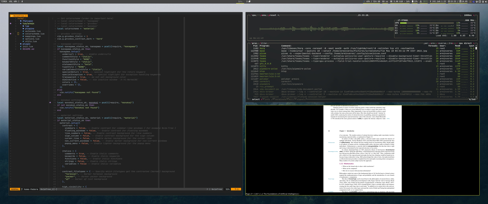

# dotconf-files

## Description

Handcrafted dotfiles for personal use, currently on Fedora Workstation 35.

| Type                 | Currently in use                                                                                  | Alternative |
| -------------------- | ------------------------------------------------------------------------------------------------- | ----------- |
| Window Manager       | i3                                                                                                | Awesome     |
| Status bar           | Polybar                                                                                           | <!-- -->    |
| Notifications        | dunst                                                                                             |             |
| Shell                | zsh                                                                                               | <!-- -->    |
| Editor               | [NeoVIM](https://github.com/arminveres/dotconf-files/tree/home-fedora/dotfiles/nvim/.config/nvim) | <!-- -->    |
| Terminal Emulator    | kitty                                                                                             | Alacritty   |
| Terminal Multiplexer | [TMUX](https://github.com/arminveres/tmux-config)                                                 | <!-- -->    |

## Usage

first run: \
Move or delete dotfiles which should be changed and then inside dotfiles do: \
`stow -vt ~ *`

Use following if you want to overwrite files in repo: \
`stow --adopt -vt ~ *`

## Dependencies

GNU stow, found either preinstalled or installable on all major distributions.

`# dnf install stow`

## TODO

- [ ] Move over to AwesomeWM
- [ ] Add script/function to correctly handle stowing, e.g. [ansible](https://medium.com/espinola-designs/manage-your-dotfiles-with-ansible-6dbedd5532bb)
- [ ] Customize `dunst` notifications
- [ ] Clean up `git` history
